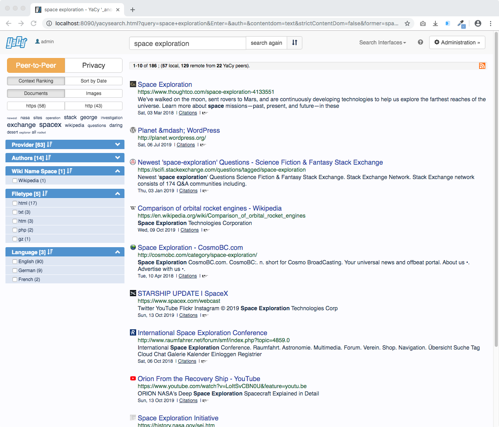

<!--
N.B.: This README was automatically generated by https://github.com/YunoHost/apps/tree/master/tools/README-generator
It shall NOT be edited by hand.
-->

# YaCy for YunoHost

[](https://dash.yunohost.org/appci/app/yacy)  

[](https://install-app.yunohost.org/?app=yacy)

*[Lire ce readme en français.](./README_fr.md)*

> *This package allows you to install YaCy quickly and simply on a YunoHost server.
If you don't have YunoHost, please consult [the guide](https://yunohost.org/#/install) to learn how to install it.*

## Overview

The YaCy search engine software provides results from a network of independent peers, instead of a central server. It is a distributed network where no single entity decides what to list or order it appears in.


**Shipped version:** 1.924~ynh1

## Screenshots



## Disclaimers / important information

You can reset the Yacy administration password from the commande line using:

```
sudo -u yacy YACY_DATA_PATH=/home/yunohost.app/yacy/DATA /var/www/yacy/bin/passwd.sh youpassword
```

## Documentation and resources

* Official app website: <https://yacy.net/>
* Upstream app code repository: <https://github.com/yacy/yacy_search_server>
* YunoHost documentation for this app: <https://yunohost.org/app_yacy>
* Report a bug: <https://github.com/YunoHost-Apps/yacy_ynh/issues>

## Developer info

Please send your pull request to the [testing branch](https://github.com/YunoHost-Apps/yacy_ynh/tree/testing).

To try the testing branch, please proceed like that.

``` bash
sudo yunohost app install https://github.com/YunoHost-Apps/yacy_ynh/tree/testing --debug
or
sudo yunohost app upgrade yacy -u https://github.com/YunoHost-Apps/yacy_ynh/tree/testing --debug
```

**More info regarding app packaging:** <https://yunohost.org/packaging_apps>
